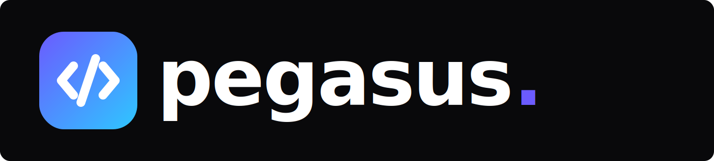

<p align="center">
  
</p>

> **[!TIP]**
>
> **Learn more about Agentic Coding!**
>
> Pegasus itself was built by a group of engineers using AI and agentic coding techniques to build features faster than ever. By leveraging tools like Cursor IDE and Claude Code CLI, the team orchestrated AI agents to implement complex functionality in days instead of weeks.
>
> **Learn how:** Master these same techniques and workflows in the [Agentic Jumpstart course](https://agenticjumpstart.com/?utm=pegasus-gh).

# Pegasus

**Stop typing code. Start directing AI agents.**

<details open>
<summary><h2>Table of Contents</h2></summary>

- [What Makes Pegasus Different?](#what-makes-pegasus-different)
  - [The Workflow](#the-workflow)
  - [Powered by Claude Agent SDK](#powered-by-claude-agent-sdk)
  - [Why This Matters](#why-this-matters)
- [Security Disclaimer](#security-disclaimer)
- [Community & Support](#community--support)
- [Getting Started](#getting-started)
  - [Prerequisites](#prerequisites)
  - [Quick Start](#quick-start)
- [How to Run](#how-to-run)
  - [Development Mode](#development-mode)
  - [Interactive TUI Launcher](#interactive-tui-launcher-recommended-for-new-users)
  - [Building for Production](#building-for-production)
  - [Testing](#testing)
  - [Linting](#linting)
  - [Environment Configuration](#environment-configuration)
  - [Authentication Setup](#authentication-setup)
- [Features](#features)
  - [Core Workflow](#core-workflow)
  - [AI & Planning](#ai--planning)
  - [Project Management](#project-management)
  - [Collaboration & Review](#collaboration--review)
  - [Developer Tools](#developer-tools)
  - [Advanced Features](#advanced-features)
- [Tech Stack](#tech-stack)
  - [Frontend](#frontend)
  - [Backend](#backend)
  - [Testing & Quality](#testing--quality)
  - [Shared Libraries](#shared-libraries)
- [Available Views](#available-views)
- [Architecture](#architecture)
  - [Monorepo Structure](#monorepo-structure)
  - [How It Works](#how-it-works)
  - [Key Architectural Patterns](#key-architectural-patterns)
  - [Security & Isolation](#security--isolation)
  - [Data Storage](#data-storage)
- [Learn More](#learn-more)
- [License](#license)

</details>

Pegasus is an autonomous AI development studio that transforms how you build software. Instead of manually writing every line of code, you describe features on a Kanban board and watch as AI agents powered by Claude Agent SDK automatically implement them. Built with React, Vite, Electron, and Express, Pegasus provides a complete workflow for managing AI agents through a desktop application (or web browser), with features like real-time streaming, git worktree isolation, plan approval, and multi-agent task execution.


## What Makes Pegasus Different?

Traditional development tools help you write code. Pegasus helps you **orchestrate AI agents** to build entire features autonomously. Think of it as having a team of AI developers working for you—you define what needs to be built, and Pegasus handles the implementation.

### The Workflow

1. **Add Features** - Describe features you want built (with text, images, or screenshots)
2. **Move to "In Progress"** - Pegasus automatically assigns an AI agent to implement the feature
3. **Watch It Build** - See real-time progress as the agent writes code, runs tests, and makes changes
4. **Review & Verify** - Review the changes, run tests, and approve when ready
5. **Ship Faster** - Build entire applications in days, not weeks

### Powered by Claude Agent SDK

Pegasus leverages the [Claude Agent SDK](https://www.npmjs.com/package/@anthropic-ai/claude-agent-sdk) to give AI agents full access to your codebase. Agents can read files, write code, execute commands, run tests, and make git commits—all while working in isolated git worktrees to keep your main branch safe. The SDK provides autonomous AI agents that can use tools, make decisions, and complete complex multi-step tasks without constant human intervention.

### Why This Matters

The future of software development is **agentic coding**—where developers become architects directing AI agents rather than manual coders. Pegasus puts this future in your hands today, letting you experience what it's like to build software 10x faster with AI agents handling the implementation while you focus on architecture and business logic.

## Community & Support

Join the **Agentic Jumpstart** to connect with other builders exploring **agentic coding** and autonomous development workflows.

In the Discord, you can:

- 💬 Discuss agentic coding patterns and best practices
- 🧠 Share ideas for AI-driven development workflows
- 🛠️ Get help setting up or extending Pegasus
- 🚀 Show off projects built with AI agents
- 🤝 Collaborate with other developers and contributors

👉 **Join the Discord:** [Agentic Jumpstart Discord](https://discord.gg/jjem7aEDKU)

---

## Getting Started

### Prerequisites

- **Node.js 22+** (required: >=22.0.0 <23.0.0)
- **pnpm** - Install with `npm install -g pnpm`
- **[Claude Code CLI](https://code.claude.com/docs/en/overview)** - Install and authenticate with your Anthropic subscription. Pegasus integrates with your authenticated Claude Code CLI to access Claude models.

### Quick Start

```bash
# 1. Clone the repository
git clone https://github.com/Pegasus-Org/pegasus.git
cd pegasus

# 2. Install dependencies
pnpm install

# 3. Start Pegasus
pnpm dev
# Choose between:
#   1. Web Application (browser at localhost:3007)
#   2. Desktop Application (Electron - recommended)
```

**Authentication:** Pegasus integrates with your authenticated Claude Code CLI. Make sure you have [installed and authenticated](https://code.claude.com/docs/en/quickstart) the Claude Code CLI before running Pegasus. Your CLI credentials will be detected automatically.

**For Development:** `pnpm dev` starts the development server with Vite live reload and hot module replacement for fast refresh and instant updates as you make changes.

## How to Run

### Development Mode

Start Pegasus in development mode:

```bash
pnpm dev
```

This will prompt you to choose your run mode, or you can specify a mode directly:

#### Electron Desktop App (Recommended)

```bash
# Standard development mode
pnpm dev:electron

# With DevTools open automatically
pnpm dev:electron:debug

# For WSL (Windows Subsystem for Linux)
pnpm dev:electron:wsl

# For WSL with GPU acceleration
pnpm dev:electron:wsl:gpu
```

#### Web Browser Mode

```bash
# Run in web browser (http://localhost:3007)
pnpm dev:web
```

### Interactive TUI Launcher (Recommended for New Users)

For a user-friendly interactive menu, use the built-in TUI launcher script:

```bash
# Show interactive menu with all launch options
./start-pegasus.sh

# Or launch directly without menu
./start-pegasus.sh web          # Web browser
./start-pegasus.sh electron     # Desktop app
./start-pegasus.sh electron-debug  # Desktop + DevTools

# Additional options
./start-pegasus.sh --help       # Show all available options
./start-pegasus.sh --version    # Show version information
./start-pegasus.sh --check-deps # Verify project dependencies
./start-pegasus.sh --no-colors  # Disable colored output
./start-pegasus.sh --no-history # Don't remember last choice
```

**Features:**

- 🎨 Beautiful terminal UI with gradient colors and ASCII art
- ⌨️ Interactive menu (press 1-3 to select, Q to exit)
- 💾 Remembers your last choice
- ✅ Pre-flight checks (validates Node.js, pnpm, dependencies)
- 📏 Responsive layout (adapts to terminal size)
- ⏱️ 30-second timeout for hands-free selection
- 🌐 Cross-shell compatible (bash/zsh)

**History File:**
Your last selected mode is saved in `~/.pegasus_launcher_history` for quick re-runs.

### Building for Production

#### Web Application

```bash
# Build for web deployment (uses Vite)
pnpm build
```

#### Desktop Application

```bash
# Build for current platform (macOS/Windows/Linux)
pnpm build:electron

# Platform-specific builds
pnpm build:electron:mac     # macOS (DMG + ZIP, x64 + arm64)
pnpm build:electron:win     # Windows (NSIS installer, x64)
pnpm build:electron:linux   # Linux (AppImage + DEB + RPM, x64)

# Output directory: apps/ui/release/
```

**Linux Distribution Packages:**

- **AppImage**: Universal format, works on any Linux distribution
- **DEB**: Ubuntu, Debian, Linux Mint, Pop!\_OS
- **RPM**: Fedora, RHEL, Rocky Linux, AlmaLinux, openSUSE

**Installing on Fedora/RHEL:**

```bash
# Download the RPM package
wget https://github.com/Pegasus-Org/pegasus/releases/latest/download/Pegasus-<version>-x86_64.rpm

# Install with dnf (Fedora)
sudo dnf install ./Pegasus-<version>-x86_64.rpm

# Or with yum (RHEL/CentOS)
sudo yum localinstall ./Pegasus-<version>-x86_64.rpm
```

#### Docker Deployment

Docker provides the most secure way to run Pegasus by isolating it from your host filesystem.

```bash
# Build and run with Docker Compose
docker-compose up -d

# Access UI at http://localhost:3007
# API at http://localhost:3008

# View logs
docker-compose logs -f

# Stop containers
docker-compose down
```

##### Authentication

Pegasus integrates with your authenticated Claude Code CLI. To use CLI authentication in Docker, mount your Claude CLI config directory (see [Claude CLI Authentication](#claude-cli-authentication) below).

##### Working with Projects (Host Directory Access)

By default, the container is isolated from your host filesystem. To work on projects from your host machine, create a `docker-compose.override.yml` file (gitignored):

```yaml
services:
  server:
    volumes:
      # Mount your project directories
      - /path/to/your/project:/projects/your-project
```

##### Claude CLI Authentication

Mount your Claude CLI config directory to use your authenticated CLI credentials:

```yaml
services:
  server:
    volumes:
      # Linux/macOS
      - ~/.claude:/home/pegasus/.claude
      # Windows
      - C:/Users/YourName/.claude:/home/pegasus/.claude
```

**Note:** The Claude CLI config must be writable (do not use `:ro` flag) as the CLI writes debug files.

> **⚠️ Important: Linux/WSL Users**
>
> The container runs as UID 1001 by default. If your host user has a different UID (common on Linux/WSL where the first user is UID 1000), you must create a `.env` file to match your host user:
>
> ```bash
> # Check your UID/GID
> id -u  # outputs your UID (e.g., 1000)
> id -g  # outputs your GID (e.g., 1000)
> ```
>
> Create a `.env` file in the pegasus directory:
>
> ```
> UID=1000
> GID=1000
> ```
>
> Then rebuild the images:
>
> ```bash
> docker compose build
> ```
>
> Without this, files written by the container will be inaccessible to your host user.

##### GitHub CLI Authentication (For Git Push/PR Operations)

To enable git push and GitHub CLI operations inside the container:

```yaml
services:
  server:
    volumes:
      # Mount GitHub CLI config
      # Linux/macOS
      - ~/.config/gh:/home/pegasus/.config/gh
      # Windows
      - 'C:/Users/YourName/AppData/Roaming/GitHub CLI:/home/pegasus/.config/gh'

      # Mount git config for user identity (name, email)
      - ~/.gitconfig:/home/pegasus/.gitconfig:ro
    environment:
      # GitHub token (required on Windows where tokens are in Credential Manager)
      # Get your token with: gh auth token
      - GH_TOKEN=${GH_TOKEN}
```

Then add `GH_TOKEN` to your `.env` file:

```bash
GH_TOKEN=gho_your_github_token_here
```

##### Complete docker-compose.override.yml Example

```yaml
services:
  server:
    volumes:
      # Your projects
      - /path/to/project1:/projects/project1
      - /path/to/project2:/projects/project2

      # Authentication configs
      - ~/.claude:/home/pegasus/.claude
      - ~/.config/gh:/home/pegasus/.config/gh
      - ~/.gitconfig:/home/pegasus/.gitconfig:ro
    environment:
      - GH_TOKEN=${GH_TOKEN}
```

##### Architecture Support

The Docker image supports both AMD64 and ARM64 architectures. The GitHub CLI and Claude CLI are automatically downloaded for the correct architecture during build.

##### Playwright for Automated Testing

The Docker image includes **Playwright Chromium pre-installed** for AI agent verification tests. When agents implement features in automated testing mode, they use Playwright to verify the implementation works correctly.

**No additional setup required** - Playwright verification works out of the box.

#### Optional: Persist browsers for manual updates

By default, Playwright Chromium is pre-installed in the Docker image. If you need to manually update browsers or want to persist browser installations across container restarts (not image rebuilds), you can mount a volume.

**Important:** When you first add this volume mount to an existing setup, the empty volume will override the pre-installed browsers. You must re-install them:

```bash
# After adding the volume mount for the first time
docker exec --user pegasus -w /app pegasus-server npx playwright install chromium
```

Add this to your `docker-compose.override.yml`:

```yaml
services:
  server:
    volumes:
      - playwright-cache:/home/pegasus/.cache/ms-playwright

volumes:
  playwright-cache:
    name: pegasus-playwright-cache
```

**Updating browsers manually:**

```bash
docker exec --user pegasus -w /app pegasus-server npx playwright install chromium
```

### Testing

#### End-to-End Tests (Playwright)

```bash
pnpm test            # Headless E2E tests
pnpm test:headed     # Browser visible E2E tests
```

#### Unit Tests (Vitest)

```bash
pnpm test:server              # Server unit tests
pnpm test:server:coverage     # Server tests with coverage
pnpm test:packages            # All shared package tests
pnpm test:all                 # Packages + server tests
```

#### Test Configuration

- E2E tests run on ports 3007 (UI) and 3008 (server)
- Automatically starts test servers before running
- Uses Chromium browser via Playwright
- Mock agent mode available in CI with `PEGASUS_MOCK_AGENT=true`

### Linting

```bash
# Run ESLint
pnpm lint
```

### Environment Configuration

#### Optional - Server

- `PORT` - Server port (default: 3008)
- `DATA_DIR` - Data storage directory (default: ./data)
- `ENABLE_REQUEST_LOGGING` - HTTP request logging (default: true)

#### Optional - Security

- `PEGASUS_API_KEY` - Optional API authentication for the server
- `ALLOWED_ROOT_DIRECTORY` - Restrict file operations to specific directory
- `CORS_ORIGIN` - CORS allowed origins (comma-separated list; defaults to localhost only)

#### Optional - Development

- `VITE_SKIP_ELECTRON` - Skip Electron in dev mode
- `OPEN_DEVTOOLS` - Auto-open DevTools in Electron
- `PEGASUS_SKIP_SANDBOX_WARNING` - Skip sandbox warning dialog (useful for dev/CI)
- `PEGASUS_AUTO_LOGIN=true` - Skip login prompt in development (ignored when NODE_ENV=production)

### Authentication Setup

Pegasus integrates with your authenticated Claude Code CLI and uses your Anthropic subscription.

Install and authenticate the Claude Code CLI following the [official quickstart guide](https://code.claude.com/docs/en/quickstart).

Once authenticated, Pegasus will automatically detect and use your CLI credentials. No additional configuration needed!

## Features

### Core Workflow

- 📋 **Kanban Board** - Visual drag-and-drop board to manage features through backlog, in progress, waiting approval, and verified stages
- 🤖 **AI Agent Integration** - Automatic AI agent assignment to implement features when moved to "In Progress"
- 🔀 **Git Worktree Isolation** - Each feature executes in isolated git worktrees to protect your main branch
- 📡 **Real-time Streaming** - Watch AI agents work in real-time with live tool usage, progress updates, and task completion
- 🔄 **Follow-up Instructions** - Send additional instructions to running agents without stopping them
- ❓ **Agent Question System** - Agents can pause mid-task to ask you clarifying questions and resume automatically once answered
- 🧑‍💻 **Question Helper Chat** - While agents wait for answers, chat with a read-only helper sub-agent to explore the codebase (grep, read, glob) before responding
- 📜 **YAML Pipelines** - Define multi-stage execution pipelines in YAML with Handlebars template variables, per-stage model overrides, and checkpoint-based resumption
- 📥 **Pipeline Inputs** - Configure typed inputs (text, number, boolean) for pipelines that are available to agents via template variables

### AI & Planning

- 🧠 **Multi-Model Support** - Choose from Claude Opus, Sonnet, and Haiku per feature
- 💭 **Extended Thinking** - Configurable reasoning effort (none, medium, deep, ultra) for complex problem-solving with per-feature control
- 📝 **Planning Modes** - Four planning levels: skip (direct implementation), lite (quick plan), spec (task breakdown), full (phased execution)
- ✅ **Plan Approval** - Review and approve AI-generated plans before implementation begins
- 📊 **Multi-Agent Task Execution** - Spec mode spawns dedicated agents per task for focused implementation
- 🔌 **Multi-Provider Support** - Extensible provider system with six built-in providers: Claude (Anthropic), OpenAI Codex, GitHub Copilot, Cursor, Google Gemini, and OpenCode

### Project Management

- 🔍 **Project Analysis** - AI-powered codebase analysis to understand your project structure
- 💡 **Feature Suggestions** - AI-generated feature suggestions based on project analysis
- 📁 **Context Management** - Add markdown, images, and documentation files that agents automatically reference
- 🔗 **Dependency Blocking** - Features can depend on other features, enforcing execution order
- 🌳 **Graph View** - Visualize feature dependencies with interactive graph visualization
- 📋 **GitHub Integration** - Import issues, validate feasibility, and convert to tasks automatically

### Collaboration & Review

- 🧪 **Verification Workflow** - Features move to "Waiting Approval" for review and testing
- 💬 **Agent Chat** - Interactive chat sessions with AI agents for exploratory work
- 👤 **AI Profiles** - Create custom agent configurations with different prompts, models, and settings
- 📜 **Session History** - Persistent chat sessions across restarts with full conversation history
- 🔍 **Git Diff Viewer** - Review changes made by agents before approving
- ✨ **Feature Enhancement** - AI-powered description improvement with modes: improve, technical, simplify, acceptance criteria, and UX review

### Developer Tools

- 🖥️ **Integrated Terminal** - Full terminal access with tabs, splits, and persistent sessions
- 🖼️ **Image Support** - Attach screenshots and diagrams to feature descriptions for visual context
- ⚡ **Concurrent Execution** - Configure how many features can run simultaneously (default: 3)
- ⌨️ **Keyboard Shortcuts** - Fully customizable shortcuts for navigation and actions
- 🎨 **Theme System** - 25+ themes including Dark, Light, Dracula, Nord, Catppuccin, and more
- 🖥️ **Cross-Platform** - Desktop app for macOS (x64, arm64), Windows (x64), and Linux (x64)
- 🌐 **Web Mode** - Run in browser or as Electron desktop app

### Advanced Features

- 🔐 **Docker Isolation** - Security-focused Docker deployment with no host filesystem access
- 🎯 **Worktree Management** - Create, switch, commit, and create PRs from worktrees
- 📊 **Usage Tracking** - Monitor Claude API usage with detailed metrics
- 🔊 **Audio Notifications** - Optional completion sounds (mutable in settings)
- 💾 **Auto-save** - All work automatically persisted to `.pegasus/` directory
- 🔄 **Recovery & Resilience** - Automatic recovery of orphaned features on restart, pipeline checkpoint resumption, and question state persistence across restarts
- 🧩 **MCP Extensibility** - Model Context Protocol SDK integration for extending agent capabilities with custom tools

## Tech Stack

### Frontend

- **React 19** - UI framework
- **Vite 7** - Build tool and development server
- **Electron 39** - Desktop application framework
- **TypeScript 5.9** - Type safety
- **TanStack Router** - File-based routing
- **Zustand 5** - State management with persistence
- **Tailwind CSS 4** - Utility-first styling with 25+ themes
- **Radix UI** - Accessible component primitives
- **dnd-kit** - Drag and drop for Kanban board
- **@xyflow/react** - Graph visualization for dependencies
- **xterm.js** - Integrated terminal emulator
- **CodeMirror 6** - Code editor for XML/syntax highlighting
- **Lucide Icons** - Icon library

### Backend

- **Node.js** - JavaScript runtime with ES modules
- **Express 5** - HTTP server framework
- **TypeScript 5.9** - Type safety
- **Claude Agent SDK** - AI agent integration (@anthropic-ai/claude-agent-sdk)
- **WebSocket (ws)** - Real-time event streaming
- **node-pty** - PTY terminal sessions
- **Zod** - Schema validation for API and pipeline inputs
- **Handlebars** - Template compilation for pipeline stage prompts
- **YAML** - Pipeline definition parsing
- **MCP SDK** - Model Context Protocol for agent extensibility

### Testing & Quality

- **Playwright** - End-to-end testing
- **Vitest** - Unit testing framework
- **ESLint 9** - Code linting
- **Prettier 3** - Code formatting
- **Husky** - Git hooks for pre-commit formatting

### Shared Libraries

- **@pegasus/types** - Shared TypeScript definitions
- **@pegasus/utils** - Logging, error handling, image processing
- **@pegasus/prompts** - AI prompt templates
- **@pegasus/platform** - Path management and security
- **@pegasus/model-resolver** - Claude model alias resolution
- **@pegasus/dependency-resolver** - Feature dependency ordering
- **@pegasus/git-utils** - Git operations and worktree management
- **@pegasus/spec-parser** - Specification parsing and analysis
- **@pegasus/chat-ui** - Headless React chat UI components (messages, input, tool timeline, streaming)

## Available Views

Pegasus provides several specialized views accessible via the sidebar or keyboard shortcuts:

| View               | Shortcut | Description                                                                                      |
| ------------------ | -------- | ------------------------------------------------------------------------------------------------ |
| **Board**          | `K`      | Kanban board for managing feature workflow (Backlog → In Progress → Waiting Approval → Verified) |
| **Agent**          | `A`      | Interactive chat sessions with AI agents for exploratory work and questions                      |
| **Spec**           | `D`      | Project specification editor with AI-powered generation and feature suggestions                  |
| **Context**        | `C`      | Manage context files (markdown, images) that AI agents automatically reference                   |
| **Settings**       | `S`      | Configure themes, shortcuts, defaults, authentication, and more                                  |
| **Terminal**       | `T`      | Integrated terminal with tabs, splits, and persistent sessions                                   |
| **Graph**          | `H`      | Visualize feature dependencies with interactive graph visualization                              |
| **Ideation**       | `I`      | Brainstorm and generate ideas with AI assistance                                                 |
| **Memory**         | `Y`      | View and manage agent memory and conversation history                                            |
| **GitHub Issues**  | `G`      | Import and validate GitHub issues, convert to tasks                                              |
| **GitHub PRs**     | `R`      | View and manage GitHub pull requests                                                             |
| **Running Agents** | -        | View all active agents across projects with status and progress                                  |

### Keyboard Navigation

All shortcuts are customizable in Settings. Default shortcuts:

- **Navigation:** `K` (Board), `A` (Agent), `D` (Spec), `C` (Context), `S` (Settings), `T` (Terminal), `H` (Graph), `I` (Ideation), `Y` (Memory), `G` (GitHub Issues), `R` (GitHub PRs)
- **UI:** `` ` `` (Toggle sidebar)
- **Actions:** `N` (New item in current view), `O` (Open project), `P` (Project picker)
- **Projects:** `Q`/`E` (Cycle previous/next project)
- **Terminal:** `Alt+D` (Split right), `Alt+S` (Split down), `Alt+W` (Close), `Alt+T` (New tab)

## Architecture

### Monorepo Structure

Pegasus is built as a pnpm workspace monorepo with two main applications and nine shared packages:

```text
pegasus/
├── apps/
│   ├── ui/          # React + Vite + Electron frontend
│   └── server/      # Express + WebSocket backend
└── libs/            # Shared packages
    ├── types/                  # Core TypeScript definitions
    ├── utils/                  # Logging, errors, utilities
    ├── prompts/                # AI prompt templates
    ├── platform/               # Path management, security
    ├── model-resolver/         # Claude model aliasing
    ├── dependency-resolver/    # Feature dependency ordering
    ├── git-utils/              # Git operations & worktree management
    ├── spec-parser/            # Specification parsing and analysis
    └── chat-ui/                # Headless React chat UI components
```

### How It Works

1. **Feature Definition** - Users create feature cards on the Kanban board with descriptions, images, and configuration
2. **Git Worktree Creation** - When a feature starts, a git worktree is created for isolated development
3. **Agent Execution** - The selected AI agent (Claude, Codex, Copilot, etc.) executes in the worktree with full file system and command access
4. **Real-time Streaming** - Agent output streams via WebSocket to the frontend for live monitoring
5. **Agent Questions** - Agents can pause execution to ask clarifying questions; answers are persisted and execution auto-resumes
6. **YAML Pipeline Execution** - For pipeline-configured features, stages execute sequentially with template variable resolution and checkpoint-based resumption
7. **Plan Approval** (optional) - For spec/full planning modes, agents generate plans that require user approval
8. **Multi-Agent Tasks** (spec mode) - Each task in the spec gets a dedicated agent for focused implementation
9. **Verification** - Features move to "Waiting Approval" where changes can be reviewed via git diff
10. **Integration** - After approval, changes can be committed and PRs created from the worktree

### Key Architectural Patterns

- **Event-Driven Architecture** - All server operations emit events that stream to the frontend
- **Provider Pattern** - Extensible AI provider system with a registration-based factory supporting Claude, Codex, Copilot, Cursor, Gemini, and OpenCode
- **Service-Oriented Backend** - Modular services for agent management, features, terminals, settings
- **State Management** - Zustand with persistence for frontend state across restarts
- **File-Based Storage** - No database; features stored as JSON files in `.pegasus/` directory
- **Checkpoint-Based Resumption** - YAML pipelines and question flows use JSON checkpoint files to resume from where they left off after restart
- **Error Classification** - `PauseExecutionError` distinguishes intentional pauses (questions, approvals) from actual failures, preventing false error reporting

### Security & Isolation

- **Git Worktrees** - Each feature executes in an isolated git worktree, protecting your main branch
- **Path Sandboxing** - Optional `ALLOWED_ROOT_DIRECTORY` restricts file access
- **Docker Isolation** - Recommended deployment uses Docker with no host filesystem access
- **Plan Approval** - Optional plan review before implementation prevents unwanted changes

### Data Storage

Pegasus uses a file-based storage system (no database required):

#### Per-Project Data

Stored in `{projectPath}/.pegasus/`:

```text
.pegasus/
├── features/              # Feature JSON files and images
│   └── {featureId}/
│       ├── feature.json        # Feature metadata and question state
│       ├── agent-output.md     # AI agent output log
│       ├── pipeline-state.json # YAML pipeline execution checkpoints
│       └── images/             # Attached images
├── context/               # Context files for AI agents
├── pipelines/             # User-defined YAML pipeline definitions
├── worktrees/             # Git worktree metadata
├── validations/           # GitHub issue validation results
├── ideation/              # Brainstorming and analysis data
│   └── analysis.json      # Project structure analysis
├── board/                 # Board-related data
├── images/                # Project-level images
├── settings.json          # Project-specific settings
├── app_spec.txt           # Project specification (XML format)
├── active-branches.json   # Active git branches tracking
└── execution-state.json   # Auto-mode execution state
```

#### Global Data

Stored in `DATA_DIR` (default `./data`):

```text
data/
├── settings.json          # Global settings, profiles, shortcuts
├── credentials.json       # API keys (encrypted)
├── sessions-metadata.json # Chat session metadata
└── agent-sessions/        # Conversation histories
    └── {sessionId}.json
```

---

> **[!CAUTION]**
>
> ## Security Disclaimer
>
> **This software uses AI-powered tooling that has access to your operating system and can read, modify, and delete files. Use at your own risk.**
>
> We have reviewed this codebase for security vulnerabilities, but you assume all risk when running this software. You should review the code yourself before running it.
>
> **We do not recommend running Pegasus directly on your local computer** due to the risk of AI agents having access to your entire file system. Please sandbox this application using Docker or a virtual machine.
>
> **[Read the full disclaimer](./DISCLAIMER.md)**

---

## Learn More

### Documentation

- [Contributing Guide](./CONTRIBUTING.md) - How to contribute to Pegasus
- [Project Documentation](./docs/) - Architecture guides, patterns, and developer docs
- [Shared Packages Guide](./docs/llm-shared-packages.md) - Using monorepo packages

### Community

Join the **Agentic Jumpstart** Discord to connect with other builders exploring **agentic coding**:

👉 [Agentic Jumpstart Discord](https://discord.gg/jjem7aEDKU)

## License

This project is licensed under the **MIT License**. See [LICENSE](LICENSE) for the full text.
