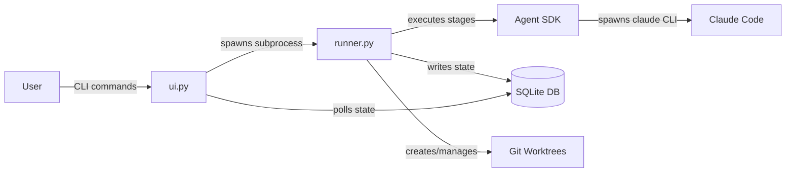

<!--
DESIGN_VERSION: 2.0
GENERATED: 2026-03-31T21:00:00Z
RESEARCH_MODE: agent-swarm + multi-model
RESEARCH_AGENTS: 8 agents dispatched
RESEARCH_SOURCES: ~31 source hits
DEEP_RESEARCH_USED: true
GEMINI_COLLABORATION: true
CODEX_ADVERSARIAL_REVIEW: true
CODEX_CRITICAL_ISSUES: 2 (1 resolved, 1 mitigated)
CODEX_REVISION_CYCLES: 1
OFFLINE_MODE: false
COMPLEXITY_BUDGET: {components:3/3, interfaces:2/2, nodes:4/5}
-->

# Pegasus MVP Specification

**Version**: 0.1.0
**Owner**: TBA
**Date**: 2026-03-31
**Status**: Draft

## Executive Summary

- **What**: Pegasus is a Python CLI/TUI tool that orchestrates Claude Code through YAML-defined multi-stage pipelines, each running in an isolated git worktree
- **Why**: Developers need a structured way to run repeatable, multi-step AI coding workflows (bug fixes, features, refactors) without manually chaining Claude Code invocations
- **Architecture**: State-Machine Orchestrator -- 3 Python modules where SQLite is the sole bridge between a headless pipeline runner and the UI layer, enabling future GUI support with zero runner changes
- **Key outcome**: Users define pipelines once in YAML, then run `pegasus run --pipeline bug-fix --desc "Login fails"` and monitor progress in a rich terminal dashboard

## Scope

### In Scope
- CLI commands: `init`, `run`, `status`, `validate`, `tui`, `diff`, `merge`, `resume`, `cleanup`, `list pipelines`, `history`
- YAML pipeline definitions with curated per-stage `claude_flags` (allowlisted subset)
- Claude Agent SDK integration via `PegasusEngine` abstraction layer (pinned SDK version)
- Single-session execution mode -- `PegasusEngine` manages persistent `session_id` (stored in `tasks.session_id`) via the SDK's session lifecycle; `pegasus resume` continues from the failed stage using stored session context
- Git worktree isolation per task with configurable `setup_command`
- SQLite state management (WAL mode, max 3 concurrent tasks)
- Textual TUI with dashboard (split pane) and focus (tabbed) views
- Cost tracking per task/stage (display only)
- Dry run mode (`pegasus run --dry-run`)
- Pydantic-based YAML validation with typo detection (Levenshtein distance)
- Layered config: project (`.pegasus/`) > user (`~/.config/pegasus/`) > built-in
- Permission model: allowlisted flags, deny-wins, default-require-approval for write stages
- Standalone binary distribution via Nuitka

### Out of Scope
- Conditional branching in pipelines (v0.3+)
- Parallel stage execution within a pipeline (v0.3+)
- Subagent execution mode (v0.2)
- Custom hooks/side effects at pipeline events (v0.2)
- Web GUI dashboard (v0.3+)
- GitHub Issues / Linear / external tracker integration (v0.3+)
- Pipeline template registry or marketplace (v0.3+)
- TOML configuration format
- Shared/reusable stages and pipeline composition (v0.2)
- Hard cost budgets with auto-pause via SDK's `max_budget_usd` on `ClaudeAgentOptions` (v0.2)
- `--hint` flag for enhanced resume with failure context (v0.2)

### Assumptions
- Users have a valid Anthropic API key (Claude Code CLI is bundled with the Agent SDK dependency)
- Users have git 2.20+ installed (worktree support)
- Python 3.10+ for development; Nuitka binary for end-user distribution
- Target projects are git repositories with a remote `origin`
- Claude Agent SDK Python package maintains backward compatibility within pinned major version
- Maximum pipeline length: 10 stages (sufficient for MVP workflows)

### Constraints
- macOS and Linux support required (Windows deferred)
- YAML-only configuration (no TOML, no GUI config editor)
- Linear pipeline execution only (stage 1 -> 2 -> 3 -> ... -> N)
- Complexity budget: <=3 top-level modules, <=2 external interfaces
- SQLite single-file database (no external database servers)
- Standalone binary must work without Python runtime installed

### Deferred Ideas
- Visual drag-and-drop pipeline builder (web GUI)
- GitHub/Linear sync for automatic task ingestion
- Conditional branching (`if: "{{stages.analyze.status}} == 'no_bug'"`) and parallel stages
- Auto-conflict resolution pipeline for worktree merges
- Pipeline template registry with community sharing
- `pegasus watch` mode for file-change-triggered pipeline runs

### Specific Ideas & References
- "Like GitHub Actions / CircleCI" for YAML pipeline structure and stage naming
- "Like Git's config" for layered configuration precedence (project > user > system)
- Textual's CSS Grid for dashboard layout, `TabbedContent` for focus view
- `par` CLI tool for worktree + tmux session management patterns
- pypyr for YAML-based task runner stage structure

### v0.1 Critical Path vs Stretch

**Critical Path (must ship):**
- `pegasus init`, `run`, `validate`, `status`, `resume`, `tui`
- Pipeline YAML parsing + Pydantic validation
- `PegasusEngine` (SDK wrapper) with session management
- Git worktree lifecycle (create, health-check, setup, cleanup)
- SQLite state + cost tracking (display only)
- TUI dashboard view
- Heartbeat-based crash detection

**Stretch (ship if time allows):**
- `pegasus diff`, `merge`, `history`, `cd`, `cleanup --all`
- Levenshtein typo suggestions in `validate`
- Dry run mode
- Nuitka standalone binary
- Focus (tabbed) TUI view

## End-State Snapshot

### Success Criteria
- User can define a 4-stage bug-fix pipeline in YAML and run it against a real project in under 5 minutes
- 3 tasks can run in parallel across separate worktrees without SQLite contention or file conflicts
- `pegasus validate` catches YAML errors, flag typos, and invalid stage references before any API calls
- TUI dashboard shows real-time progress for all active tasks (<=500ms update latency)
- `pegasus resume` successfully restarts a failed pipeline from the exact failed stage
- `pegasus merge` integrates completed work back to the default branch with pre-merge conflict detection

### Failure Conditions & Guard-rails
- If a stage exceeds `max_turns`, the pipeline pauses (not crashes) and the user is notified
- If API rate limiting occurs, exponential backoff retries up to 5 times before marking the stage as failed
- If a worktree fails health check (dirty state from prior crash), Pegasus offers to recreate it
- If SQLite write contention exceeds `busy_timeout` (5000ms), the write is retried once before failing the operation
- If a runner process crashes mid-stage, heartbeat detection marks the task as failed and worktree as orphaned within 30s

## Architecture at a Glance

### Components (3)

1. **runner.py** -- Headless Pipeline Executor
   - Wraps Claude Agent SDK via `PegasusEngine` abstraction (Protocol-based)
   - Manages git worktree lifecycle (create, health-check, setup, cleanup)
   - Reads YAML pipeline configs, resolves layered configuration
   - Writes ALL state transitions to SQLite using `BEGIN IMMEDIATE` for safe locking
   - Maintains heartbeat (every 5s) for crash detection
   - Handles rate limiting with exponential backoff
   - Graceful shutdown: SIGTERM -> 10s grace period -> SIGKILL -> `await process.wait()`; task marked `paused` in SQLite so `pegasus resume` can continue
   - Unsets `CLAUDECODE=1` env var before spawning SDK sessions (prevents nested Claude Code conflicts)
   - Fires OS-native desktop notifications directly (`osascript` on macOS, `notify-send` on Linux) on stage/pipeline events
   - NEVER imports `ui.py` -- complete decoupling

   **SDK Callback -> Behavior Mapping:**

   | SDK Event/Callback | Pegasus Behavior |
   |--------------------|------------------|
   | `on_message()` (AssistantMessage) | Append content to `.pegasus/logs/<task-id>.log`; update TUI via SQLite |
   | `on_tool_use()` | Log tool name/input to stage_runs + task log file; enforce `disallowed_tools` from pipeline YAML |
   | `requires_approval()` | Gate: check pipeline's `requires_approval` flag; pause pipeline and write `paused` to SQLite if approval needed |
   | `on_result()` (ResultMessage) | Stage complete: update stage_runs status, record `message.total_cost_usd`, advance to next stage |
   | `on_error()` (ProcessError) | Record error in stage_runs, set status to `failed`, fire desktop notification |
   | `message.total_cost_usd` | Update `tasks.total_cost` and `stage_runs.cost` from SDK cost reporting |

2. **ui.py** -- CLI + TUI Interface
   - Click-based CLI commands (init, run, status, validate, etc.)
   - Textual TUI with dashboard (split pane) and focus (tabbed) views
   - NEVER imports `runner.py` -- reads state from SQLite only
   - Polls SQLite at ~100ms via Textual's `set_interval` (integrates with reactive system)
   - Uses `mode=ro` URI for read-only connections (NOT `immutable=1`, which caches stale data)
   - Spawns runner as a subprocess when `pegasus run` is invoked

3. **models.py** -- Shared Data Contracts
   - Pydantic models for YAML pipeline config validation
   - SQLite schema definitions (tasks, stage_runs, worktrees, schema_version tables)
   - Query functions and connection factory used by both runner and ui
   - `AgentRunnerProtocol` -- Protocol class shielding runner from SDK internals
   - Flag allowlist definitions and permission resolution
   - Config resolution logic (project > user > built-in)
   - Schema migration support via version checks

### Interfaces/Inputs (2)

1. **Claude Agent SDK (Python)** -- Spawns `claude` CLI as subprocess over JSON-lines stdio; provides typed message streams (`AssistantMessage`, `ResultMessage`), cost reporting, and error types (`ProcessError`, `CLINotFoundError`, `CLIJSONDecodeError`)
2. **Git CLI** -- Worktree create/remove/prune, branch management, merge operations, default branch detection

### Flow Diagram



## Requirements Mapping

### Functional Requirements
- **FR-001**: YAML pipeline definition -- Users define multi-stage pipelines as individual YAML files in `.pegasus/pipelines/`, each with per-stage `claude_flags` from a curated allowlist
- **FR-002**: Pipeline execution -- Execute pipeline stages sequentially via Claude Agent SDK. `PegasusEngine` manages a persistent `session_id` (stored in `tasks.session_id`) via the SDK's session lifecycle for context preservation across stages. When `output_format: json` is specified, the SDK returns structured JSON; full Pydantic schema validation of stage outputs deferred to v0.2
- **FR-003**: Task lifecycle -- Create, track (queued/running/paused/completed/failed), resume from failure, and clean up tasks with SQLite state persistence and heartbeat-based crash detection
- **FR-004**: Git worktree isolation -- Each task runs in an isolated git worktree at `~/.pegasus/worktrees/<project>--<task-id>`, branched from the auto-detected default branch
- **FR-005**: TUI dashboard -- Interactive terminal UI showing all active tasks (dashboard view) or deep-diving into one task (focus view) with real-time stage progress
- **FR-006**: Project initialization -- `pegasus init` scaffolds `.pegasus/` with auto-detected settings (language, test command, lint command, default branch) and starter pipeline templates
- **FR-007**: Pipeline validation -- `pegasus validate` checks all YAML files for schema errors, invalid stage references, unknown `claude_flags`, and typos (Levenshtein-based suggestions)
- **FR-008**: Layered configuration -- Config resolves in order: stage flags > pipeline defaults > project config > user config > built-in defaults
- **FR-009**: Cost tracking -- Track and display estimated API costs per task and per stage via Agent SDK cost reporting
- **FR-010**: Dry run mode -- `pegasus run --dry-run` resolves all templates and prints the exact Agent SDK calls without making API requests

### Non-Functional Requirements
- **NFR-001**: Standalone binary via Nuitka (>= 1.4.2) -- End users install a single binary with no Python runtime dependency
- **NFR-002**: SQLite WAL mode -- Concurrent writers (up to 3 tasks) and readers (TUI) operate without blocking, with `busy_timeout=5000ms` and `synchronous=NORMAL`
- **NFR-003**: CLI response time -- Non-API operations (`status`, `validate`, `list`) respond in <200ms using read-only SQLite connections (`mode=ro`)

### Mapping Table

| Requirement | Component | Test Method |
|------------|-----------|-------------|
| FR-001 | models.py | Unit (Pydantic model validation) |
| FR-002 | runner.py | Integration (mock Agent SDK via FakeAgentRunner) |
| FR-003 | runner.py + models.py | Unit (state transitions) + Integration (full lifecycle) |
| FR-004 | runner.py | Integration (real git worktree create/remove) |
| FR-005 | ui.py | Unit (Textual `App.run_test()` + Pilot API) + Manual |
| FR-006 | ui.py + models.py | Integration (scaffold + validate output) |
| FR-007 | models.py | Unit (valid/invalid YAML fixtures) |
| FR-008 | models.py | Unit (layered resolution with fixtures) |
| FR-009 | runner.py + models.py | Integration (mock SDK cost events) |
| FR-010 | runner.py + ui.py | Integration (verify no API calls made) |
| NFR-001 | Build pipeline | E2E (Nuitka compile + smoke test) |
| NFR-002 | models.py | Load test (3 concurrent writers + 1 reader) |
| NFR-003 | ui.py + models.py | Benchmark (time CLI commands) |

## Testing Strategy

### Unit Testing
- Pydantic model validation with valid/invalid YAML fixtures (models.py)
- State machine transitions: every valid and invalid status change (models.py)
- Config resolution: layered override correctness with edge cases (models.py)
- Flag allowlist enforcement and deny-wins logic (models.py)
- **Critical**: Use file-based SQLite fixtures (`tmp_path`), NOT `:memory:` -- WAL mode requires real files

### Integration Testing
- Mock `PegasusEngine` via `FakeAgentRunner` (Protocol-based) to test full pipeline lifecycle without API calls
- Deep mock point: `SubprocessCLITransport` in `claude_agent_sdk._internal.transport.subprocess_cli` for zero-subprocess tests
- Real git worktree create/remove/merge cycle (runner.py)
- SQLite concurrent write stress test: 3 writers + 1 poller with `mode=ro` connections
- `pegasus init` -> `pegasus validate` -> `pegasus run --dry-run` end-to-end flow
- Textual `App.run_test()` + Pilot API for TUI screens

### End-to-End Testing
- Nuitka binary compilation + smoke test on macOS and Linux (requires `--include-package-data=textual`)
- Full pipeline run with a real Claude API key against a test repository (manual/CI)

## Simplicity Note

3 modules, zero direct coupling between runner and UI, no event buses or DI. New developer path: models.py (contracts) -> runner.py (execution) -> ui.py (display). Each module contains internal subsystems but the 3-module constraint is about coupling topology. Complexity budget: 3/3 components, 2/2 interfaces.

## Architectural Decision Records (ADRs)

### ADR-001: Claude Agent SDK over Raw Subprocess

**Decision**: Use the official Claude Agent SDK (Python) instead of spawning `claude -p` subprocesses directly.

**Alternatives considered**:
1. Raw subprocess with CLI flag passthrough (original conversation design)
2. Hybrid: SDK with subprocess fallback

**Rationale**: Specific advantages over raw subprocess:
1. `message.total_cost_usd` provides typed per-message cost tracking
2. `max_budget_usd` on `ClaudeAgentOptions` enables per-task spend limits (deferred to v0.2 but mechanism exists)
3. Python async callbacks replace shell command hooks -- no more parsing stdout or injecting hook scripts
4. `output_format` accepts JSON Schema for validated stage outputs (full Pydantic integration v0.2)
5. SDK bundles the `claude` CLI binary -- cleaner distribution story; users don't need a separate CLI install
6. SDK manages persistent sessions natively via session lifecycle API

This eliminates the `pegasus _internal` hidden subcommand set (`stage-complete`, `notify`, `gate`, `log-tool`) and the per-worktree `.claude/settings.json` hook injection pattern from the original conversation design. All equivalent functionality is handled by Python callbacks within `PegasusEngine`.

**Implementation note**: The SDK itself spawns the `claude` CLI binary as a subprocess over JSON-lines stdio -- it is NOT a direct Anthropic API wrapper. Two version numbers exist: the SDK version (e.g., `0.1.48`) and the bundled CLI version (e.g., `2.1.79`). Pin via `claude-agent-sdk>=0.1.48,<0.2.0`.

**Trade-off**: Adds dependency on a rapidly-evolving SDK. Mitigated by pinning the SDK version and wrapping all SDK calls behind the `AgentRunnerProtocol`, so SDK changes affect only the concrete `ClaudeAgentRunner` class.

### ADR-002: SQLite-as-Bridge (State-Machine Orchestrator) over Direct Imports

**Decision**: runner.py and ui.py communicate exclusively through SQLite, never importing each other.

**Alternatives considered**:
1. Consolidated Three-Module (direct imports between ui and engine)
2. Event bus + modular packages

**Rationale**: This architecture enables future GUI support with zero runner changes -- any UI (TUI, web dashboard, mobile) just reads the same SQLite database. Runner crashes don't affect the TUI. Gemini validated this as "the correct choice for a long-running LLM orchestrator."

**Critical implementation detail**: TUI read connections MUST use `mode=ro` URI, NOT `immutable=1`. The `immutable=1` flag caches data and never detects external writes, serving stale state to the polling TUI. Confirmed by SQLite official forum.

**Trade-off**: TUI must poll SQLite (~100ms via Textual's `set_interval`) instead of receiving push events. Acceptable for 3 concurrent tasks; mitigated by WAL mode enabling non-blocking reads during writes.

### ADR-003: Allowlisted Flags over Full Passthrough

**Decision**: Support a curated subset of Claude Code CLI flags in pipeline YAML, rejecting unknown flags during validation.

**Supported flags**: `model`, `permission_mode`, `tools`, `max_turns`, `output_format`, `allowed_tools`, `disallowed_tools`, `add_dir`, `append_system_prompt`

**Alternatives considered**:
1. Full passthrough with deny rules
2. Strict preset modes only (readonly/edit/full)

**Rationale**: All three models in the multi-model review agreed that unrestricted passthrough creates safety, compatibility, and reproducibility risks. An allowlist protects against CLI flag surface changes and enables `pegasus validate` to catch typos.

**Trade-off**: Users cannot use newly added Claude Code flags until Pegasus adds them to the allowlist. Mitigated by clear documentation and a straightforward process for adding new flags.

### ADR-004: File-Based Logs over SQLite Blobs

**Decision**: Pipeline execution logs are written to `.pegasus/logs/<task-id>.log`, not stored in SQLite.

**Rationale**: Gemini recommended this to keep the SQLite database performant. Claude Code outputs can be large (hundreds of KB per stage), and storing them as SQLite blobs would bloat the database and degrade query performance. File-based logs are also easier to tail, grep, and stream into the TUI.

**Trade-off**: Resume/recovery relies on SQLite state alone (not logs). Logs are supplementary for human inspection. SQLite is authoritative for all state transitions.

### ADR-005: Heartbeat-Based Crash Detection

**Decision**: Runner processes write a heartbeat timestamp to SQLite every 5 seconds while executing. On startup, Pegasus detects stale tasks (heartbeat older than 30s with no running PID) and marks them as failed.

**Rationale**: The deep research found that even Anthropic's own Claude Code has an open issue (#26725) for stale worktrees that never get cleaned up. Without active crash detection, a killed runner leaves tasks permanently in "running" state and worktrees orphaned. Heartbeat + PID checking is the standard pattern for subprocess lifecycle management.

**Implementation**: Store `runner_pid` and `heartbeat_at` in the tasks table. On startup, call `os.kill(pid, 0)` to check if the process is alive. If dead + stale heartbeat, transition to `failed` and mark worktree as `orphaned` for cleanup.

## Research-Informed Design Decisions

Key findings from 8 research agents (31 sources) and multi-model review (Gemini + Codex) that directly influenced the spec:

- **40% of agent projects fail by 2027** due to governance gaps -- validates `pegasus validate`, permission ceilings, and `max_turns` guardrails
- **Supervised autonomy** (human-in-the-loop at decision points) is the emerging industry sweet spot -- validates `requires_approval` gates
- **SQLite `mode=ro` vs `immutable=1`**: TUI polling connections MUST use `mode=ro` URI; `immutable=1` caches stale data (confirmed by SQLite official forum; caught during Codex adversarial review)
- **WAL + `:memory:` incompatible**: Tests must use file-based fixtures (`tmp_path`), not `:memory:`
- **Subprocess cleanup escalation**: Python's `terminate()` doesn't guarantee cleanup; must escalate SIGTERM -> SIGKILL (adopted into runner.py spec)
- **Claude Code issue #26725**: Stale worktrees accumulate without cleanup -- validates heartbeat + DB-tracked worktree lifecycle (ADR-005)
- **Gemini** suggested the State-Machine Orchestrator pattern and file-based logging (ADR-002, ADR-004); validated architecture as "highly robust"
- **Codex adversarial review** found 2 critical issues: (1) naming confusion on auto-approval (resolved -- it means safe-by-default), (2) SQLite single-writer concern (mitigated with `BEGIN IMMEDIATE` + short transactions + `mode=ro` reads)

## Risks & Mitigations

| Risk | Severity | Mitigation |
|------|----------|------------|
| SQLite write contention under 3 concurrent writers | High | WAL mode + `BEGIN IMMEDIATE` + short transactions + `busy_timeout=5000ms` + `mode=ro` read connections for CLI/TUI |
| Claude Agent SDK breaking changes | High | Pin SDK version (`>=0.1.48,<0.2.0`) + `AgentRunnerProtocol` abstraction isolates SDK from pipeline logic |
| Runner crash leaves task in "running" state | High | Heartbeat every 5s + startup recovery checks PID liveness; marks stale tasks as failed within 30s |
| Git worktree shared state (hooks, refs, object DB) | Medium | Flag allowlists control Claude's actions; `git worktree prune` on startup; full clone isolation deferred |
| YAML DSL complexity creep as users add stages | Medium | `pegasus validate` with strict schema; max 10 stages per pipeline in MVP |
| Template variable injection into prompts | Medium | Sanitize variables, size caps (100k chars), tool specs from YAML config only |
| Nuitka binary portability (glibc, platform deps) | Medium | Nuitka >= 1.4.2 + `--include-package-data=textual` + CI builds for macOS/Linux with smoke tests |
| TUI shows stale data | Medium | Use `mode=ro` URI (NOT `immutable=1`); confirmed by SQLite forum |
| `CLAUDECODE=1` env var inheritance | Medium | `PegasusEngine` unsets `CLAUDECODE` before spawning SDK sessions: `ClaudeAgentOptions(env={"CLAUDECODE": ""})` |
| Cost overruns from expensive Opus pipelines | Low | Cost tracking display + `max_turns` per stage; hard budgets via SDK `max_budget_usd` deferred to v0.2 |
| SQLite schema evolution across versions | Low | `schema_version` table + migration checks on startup |

## Configuration & Observability

### Configuration Toggles
```yaml
# .pegasus/config.yaml
pegasus:
  version: "0.1.0"

project:
  language: python           # Auto-detected by pegasus init
  test_command: "pytest"     # Auto-detected
  lint_command: "ruff check ." # Auto-detected
  setup_command: "pip install -e ." # Run after worktree creation

git:
  default_branch: main       # Auto-detected
  branch_prefix: "pegasus/"
  auto_cleanup: true          # Remove worktree + branch after merge

defaults:
  model: claude-sonnet-4-20250514
  max_turns: 10
  permission_mode: plan
  max_permission: acceptEdits  # Permission ceiling (deny-wins)

concurrency:
  max_tasks: 3                # Max parallel task runners
  retry_max: 5                # Rate limit retry attempts
  retry_base_delay: 1.0       # Exponential backoff base (seconds)

notifications:
  on_stage_complete: desktop
  on_approval_needed: desktop
  on_pipeline_complete: desktop
  on_pipeline_failed: desktop

worktrees:
  base_path: "~/.pegasus/worktrees"
```

### Notification Mechanism
Desktop notifications use `osascript` (macOS) / `notify-send` (Linux). Notifications are fired by `runner.py` via SDK callbacks when stage/pipeline events occur -- the runner fires the OS notification directly. The TUI does not send notifications; it reads notification state from SQLite for display only.

### Logging Strategy
- Pipeline execution logs: `.pegasus/logs/<task-id>.log` (append-only, human-readable)
- TUI tails log files for live output display
- SQLite stores structured state only (status transitions, timestamps, errors, costs)
- Claude Code's own session transcripts (in `~/.claude/projects/`) provide full conversation history

### Telemetry
- No external telemetry in MVP
- `pegasus history` provides local analytics from SQLite (task count, duration, cost aggregates)

## Implementation Details

### SQLite Connection Factory

```python
import sqlite3

def make_connection(db_path: str, read_only: bool = False) -> sqlite3.Connection:
    if read_only:
        # CRITICAL: use mode=ro, NOT immutable=1
        # immutable=1 caches data and never detects external writes
        uri = f"file:{db_path}?mode=ro"
        conn = sqlite3.connect(uri, uri=True, check_same_thread=False)
    else:
        conn = sqlite3.connect(db_path, timeout=30.0, check_same_thread=False)

    conn.row_factory = sqlite3.Row
    conn.execute("PRAGMA journal_mode = WAL")
    conn.execute("PRAGMA synchronous = NORMAL")
    conn.execute("PRAGMA busy_timeout = 5000")
    conn.execute("PRAGMA wal_autocheckpoint = 100")
    conn.execute("PRAGMA foreign_keys = ON")
    return conn
```

### Safe State Transition Pattern

```python
def transition_task_state(conn, task_id, from_state, to_state, metadata=None):
    """Use BEGIN IMMEDIATE to acquire write lock upfront, avoiding TOCTOU races."""
    conn.execute("BEGIN IMMEDIATE")
    row = conn.execute("SELECT status FROM tasks WHERE id = ?", (task_id,)).fetchone()
    if row is None or row["status"] != from_state:
        conn.rollback()
        return False
    conn.execute(
        "UPDATE tasks SET status = ?, updated_at = CURRENT_TIMESTAMP WHERE id = ?",
        (to_state, task_id)
    )
    conn.commit()
    return True
```

### Agent SDK Abstraction

```python
from typing import Protocol, AsyncIterator, runtime_checkable

@runtime_checkable
class AgentRunnerProtocol(Protocol):
    """Shields runner.py from claude-agent-sdk internals."""
    async def run_task(self, prompt: str, cwd: str) -> AsyncIterator: ...
    async def interrupt(self) -> None: ...
```

### Nuitka Build Command

```bash
python3 -m nuitka \
  --mode=onefile \
  --follow-imports \
  --include-package-data=textual \
  --include-package-data=rich \
  --include-data-files=pegasus/templates/*.yaml=pegasus/templates/ \
  --enable-plugin=anti-bloat \
  pegasus/__main__.py
```

## File System Layout

```
~/.config/pegasus/                   # User-level (XDG compliant)
├── config.yaml                      # Personal defaults
└── pipelines/
    └── code-review.yaml             # Personal pipelines

your-project/
├── .pegasus/                        # Project-level (git tracked except DB/logs)
│   ├── config.yaml                  # Project settings
│   ├── pipelines/
│   │   ├── bug-fix.yaml             # Team pipeline definitions
│   │   └── feature.yaml
│   ├── pegasus.db                   # SQLite state (gitignored)
│   ├── pegasus.db-wal               # WAL journal (gitignored)
│   ├── pegasus.db-shm               # Shared memory (gitignored)
│   └── logs/                        # Task logs (gitignored)
│       ├── a3f8c2.log
│       └── b7d1e9.log
├── .gitignore                       # Includes pegasus DB + logs
└── src/

~/.pegasus/worktrees/                # Isolated worktrees (outside project)
├── myapp--a3f8c2/                   # Task a3f8c2 worktree
└── myapp--b7d1e9/                   # Task b7d1e9 worktree
```

## Database Schema

```sql
-- Schema version tracking
CREATE TABLE schema_version (
    version     INTEGER PRIMARY KEY,
    applied_at  DATETIME DEFAULT CURRENT_TIMESTAMP
);

-- Core task record
CREATE TABLE tasks (
    id            TEXT PRIMARY KEY,        -- e.g., "a3f8c2"
    pipeline      TEXT NOT NULL,           -- e.g., "bug-fix"
    description   TEXT,
    status        TEXT DEFAULT 'queued',   -- queued | running | paused | completed | failed
    created_at    DATETIME DEFAULT CURRENT_TIMESTAMP,
    updated_at    DATETIME DEFAULT CURRENT_TIMESTAMP,
    session_id    TEXT,                    -- Claude session ID for resume
    context       TEXT,                    -- User-provided context (JSON)
    branch        TEXT,                    -- e.g., "pegasus/a3f8c2-fix-login"
    worktree_path TEXT,                    -- e.g., "~/.pegasus/worktrees/myapp--a3f8c2"
    base_branch   TEXT,                   -- Auto-detected default branch
    merge_status  TEXT,                   -- pending | merged | conflict | abandoned
    total_cost    REAL DEFAULT 0.0,       -- Accumulated estimated cost (USD)
    runner_pid    INTEGER,                -- PID of runner process
    heartbeat_at  DATETIME                -- Last heartbeat timestamp
);

-- One row per stage execution
CREATE TABLE stage_runs (
    id          INTEGER PRIMARY KEY AUTOINCREMENT,
    task_id     TEXT REFERENCES tasks(id),
    stage_id    TEXT NOT NULL,           -- e.g., "analyze", "implement"
    stage_index INTEGER NOT NULL,        -- 0, 1, 2... for ordering
    status      TEXT DEFAULT 'pending',  -- pending | running | completed | failed | skipped
    started_at  DATETIME,
    finished_at DATETIME,
    error       TEXT,                    -- Error message if failed
    cost        REAL DEFAULT 0.0,        -- Stage cost estimate (USD)
    claude_flags TEXT                    -- JSON of resolved flags used
);

-- Worktree lifecycle tracking
CREATE TABLE worktrees (
    task_id    TEXT PRIMARY KEY REFERENCES tasks(id),
    path       TEXT NOT NULL UNIQUE,
    branch     TEXT NOT NULL,
    created_at DATETIME DEFAULT CURRENT_TIMESTAMP,
    status     TEXT NOT NULL DEFAULT 'active'  -- active | removed | orphaned
);

-- Indexes for polling efficiency
CREATE INDEX idx_tasks_status ON tasks(status);
CREATE INDEX idx_tasks_heartbeat ON tasks(heartbeat_at) WHERE status = 'running';
CREATE INDEX idx_stage_runs_task ON stage_runs(task_id);
```

## Pipeline YAML Schema

```yaml
# .pegasus/pipelines/bug-fix.yaml
name: Bug Fix
description: Analyze, patch, and verify a reported bug

execution:
  mode: session                      # PegasusEngine manages session_id via SDK lifecycle (MVP only mode)

defaults:
  model: claude-sonnet-4-20250514
  max_turns: 5
  permission_mode: plan

stages:
  - id: analyze
    name: Root Cause Analysis
    prompt: |
      Analyze this bug in a {{project.language}} project:
      {{task.description}}
      Identify the root cause and list all affected files.
    claude_flags:
      model: claude-sonnet-4-20250514
      permission_mode: plan
      tools: "Read,Grep,Glob"
      max_turns: 5
      output_format: json

  - id: plan
    name: Patch Plan
    prompt: |
      Based on your analysis, propose a minimal, targeted fix.
      List each file and the exact changes needed.
    claude_flags:
      permission_mode: plan
    requires_approval: true          # Human-in-the-loop gate

  - id: implement
    name: Apply Fix
    prompt: |
      Implement the approved patch plan.
    claude_flags:
      model: claude-sonnet-4-20250514
      permission_mode: acceptEdits
      max_turns: 10
    # requires_approval: true        # Auto-set (write stage default)

  - id: verify
    name: Verify
    prompt: |
      Run the test suite and linter to verify the fix.
    claude_flags:
      permission_mode: plan
      tools: "Bash({{project.test_command}}),Bash({{project.lint_command}})"
      max_turns: 3
```

## CLI Command Reference

| Command | Description |
|---------|-------------|
| `pegasus init` | Scaffold `.pegasus/` with auto-detected settings and starter templates |
| `pegasus run --pipeline <name> --desc "..."` | Create task, branch, worktree, and start pipeline |
| `pegasus run --dry-run --pipeline <name> --desc "..."` | Show resolved commands without API calls |
| `pegasus status` | List all active tasks with progress |
| `pegasus status <task-id>` | Detailed status for one task |
| `pegasus validate` | Check all pipeline YAML files for errors |
| `pegasus validate --verbose --pipeline <name>` | Show fully resolved config for a pipeline |
| `pegasus tui` | Launch the interactive terminal dashboard |
| `pegasus diff <task-id>` | Show changes between task branch and default branch |
| `pegasus merge <task-id>` | Merge completed task (auto-cleanup after) |
| `pegasus resume <task-id>` | Retry a failed pipeline from the failed stage |
| `pegasus cd <task-id>` | Print the worktree path |
| `pegasus cleanup <task-id>` | Manually remove a worktree and branch |
| `pegasus cleanup --all` | Remove all worktrees for completed/failed tasks |
| `pegasus list pipelines` | Show available pipelines with source layer tags |
| `pegasus history` | Show completed/failed task history with costs |

## TUI Layout

### Dashboard View (Split Pane)
```
+-------------------------------------------------------------+
|  PEGASUS DASHBOARD                         3 tasks running   |
+--------------------+--------------------+--------------------+
| * a3f8c2 bug-fix   | * b7d1e9 feature   | * c4f2a0 refactor |
| Login fails Safari  | Dark mode toggle   | Extract auth svc  |
|                    |                    |                    |
| [done] Analyze     | [done] Parse Reqs  | [run]  Analyze    |
| [done] Plan        | [run]  Implement   | [wait] Plan       |
| [run]  Implement   | [wait] Test        | [wait] Implement  |
| [wait] Verify      |                    | [wait] Verify     |
|                    |                    |                    |
| > Writing auth.py  | > Editing theme.ts | > Reading routes/  |
+--------------------+--------------------+--------------------+
| LOGS (a3f8c2)                                                |
| [13:42] Stage 3: Generating patch using claude-sonnet-4      |
| [13:42] Files modified: src/auth.py, src/middleware.py       |
| [13:43] ! Awaiting approval for file write...                |
+-------------------------------------------------------------+
```

### Keyboard Navigation
| Key | Action |
|-----|--------|
| `D` | Toggle Dashboard/Focus view |
| `Tab` / `Shift+Tab` | Cycle between tasks |
| `A` | Approve current stage |
| `R` | Reject/retry current stage |
| `L` | Toggle log panel |
| `Enter` | Switch to Focus view for selected task |
| `Q` | Quit TUI (tasks keep running) |

## Technology Stack

| Layer | Technology | Version | Rationale |
|-------|-----------|---------|-----------|
| Language | Python | 3.10+ | Agent SDK is Python; Textual/Rich ecosystem |
| CLI Framework | Click | 8.1+ | Unanimous research recommendation; lazy composition |
| TUI Framework | Textual | 0.40+ | Rich terminal apps; CSS Grid layout; async support |
| Terminal Styling | Rich | 13+ | Colors, tables, progress bars (Textual dependency) |
| AI Engine | Claude Agent SDK | >=0.1.48,<0.2.0 | Typed events, cost tracking, subprocess management |
| Config Validation | Pydantic | 2.0+ | YAML -> typed models with error messages |
| Database | SQLite3 | built-in | Zero dependencies; WAL mode for concurrency |
| YAML Parsing | PyYAML | 6.0+ | Standard YAML parser |
| Distribution | Nuitka | >= 1.4.2 | Python -> native binary; rich.box fix required |
| VCS | Git | 2.20+ | Worktree support (create, remove, list, prune) |

## Version Roadmap

### v0.1 (MVP) -- This Spec
- All CLI commands, TUI, pipeline execution, worktree isolation, validation
- Single session execution mode
- Cost tracking (display only)
- Heartbeat-based crash detection and recovery
- Standalone Nuitka binary

### v0.2
- Subagent execution mode (orchestrator + isolated subagents)
- Shared/reusable stages (`use: verify`)
- Pipeline composition (`use_pipeline: code-review`)
- CLAUDE.md / context file injection per pipeline
- `--hint` flag for enhanced resume
- Configurable cost budgets with auto-pause via SDK `max_budget_usd`
- Custom hooks at pipeline events
- Full Pydantic schema validation for `output_format` (structured stage outputs)

### v0.3+
- Conditional branching in pipelines
- Parallel stage execution
- Web GUI dashboard (reads same SQLite DB -- zero runner changes)
- GitHub Issues / Linear integration
- Pipeline template registry
