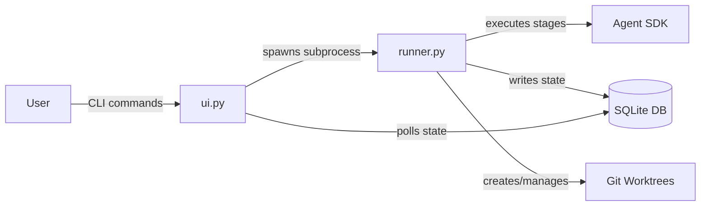

<!--
DESIGN_VERSION: 2.0
GENERATED: 2026-03-31T20:45:00Z
RESEARCH_MODE: agent-swarm + multi-model
RESEARCH_AGENTS: 8 agents dispatched
RESEARCH_SOURCES: ~31 source hits
DEEP_RESEARCH_USED: true
GEMINI_COLLABORATION: true
CODEX_ADVERSARIAL_REVIEW: true
CODEX_CRITICAL_ISSUES: 2 (1 resolved, 1 mitigated)
CODEX_REVISION_CYCLES: 1
OFFLINE_MODE: false
COMPLEXITY_BUDGET: {components:3/3, interfaces:2/2, nodes:4/5}
-->

# Pegasus MVP Specification

**Version**: 0.1.0
**Owner**: TBA
**Date**: 2026-03-31
**Status**: Draft

## Executive Summary

- **What**: Pegasus is a Python CLI/TUI tool that orchestrates Claude Code through YAML-defined multi-stage pipelines, each running in an isolated git worktree
- **Why**: Developers need a structured way to run repeatable, multi-step AI coding workflows (bug fixes, features, refactors) without manually chaining Claude Code invocations
- **Architecture**: State-Machine Orchestrator — 3 Python modules where SQLite is the sole bridge between a headless pipeline runner and the UI layer, enabling future GUI support with zero runner changes
- **Key outcome**: Users define pipelines once in YAML, then run `pegasus run --pipeline bug-fix --desc "Login fails"` and monitor progress in a rich terminal dashboard

## Scope

### In Scope
- CLI commands: `init`, `run`, `status`, `validate`, `tui`, `diff`, `merge`, `resume`, `cleanup`, `list pipelines`, `history`
- YAML pipeline definitions with curated per-stage `claude_flags` (allowlisted subset)
- Claude Agent SDK integration via `PegasusEngine` abstraction layer (pinned SDK version)
- Single-session execution mode (multi-stage via `--resume`)
- Git worktree isolation per task with configurable `setup_command`
- SQLite state management (WAL mode, max 3 concurrent tasks)
- Textual TUI with dashboard (split pane) and focus (tabbed) views
- Cost tracking per task/stage (display only)
- Dry run mode (`pegasus run --dry-run`)
- Pydantic-based YAML validation with typo detection (Levenshtein distance)
- Layered config: project (`.pegasus/`) > user (`~/.config/pegasus/`) > built-in
- Permission model: allowlisted flags, deny-wins, default-require-approval for write stages
- Standalone binary distribution via Nuitka

### Out of Scope
- Conditional branching in pipelines (v0.3+)
- Parallel stage execution within a pipeline (v0.3+)
- Subagent execution mode (v0.2)
- Custom hooks/side effects at pipeline events (v0.2)
- Web GUI dashboard (v0.3+)
- GitHub Issues / Linear / external tracker integration (v0.3+)
- Pipeline template registry or marketplace (v0.3+)
- TOML configuration format
- Shared/reusable stages and pipeline composition (v0.2)
- Hard cost budgets with auto-pause (v0.2)
- `--hint` flag for enhanced resume with failure context (v0.2)

### Assumptions
- Users have Claude Code CLI installed and a valid Anthropic API key
- Users have git 2.20+ installed (worktree support)
- Python 3.10+ for development; Nuitka binary for end-user distribution
- Target projects are git repositories with a remote `origin`
- Claude Agent SDK Python package maintains backward compatibility within pinned major version
- Maximum pipeline length: 10 stages (sufficient for MVP workflows)

### Constraints
- macOS and Linux support required (Windows deferred)
- YAML-only configuration (no TOML, no GUI config editor)
- Linear pipeline execution only (stage 1 -> 2 -> 3 -> ... -> N)
- Complexity budget: ≤3 top-level modules, ≤2 external interfaces
- SQLite single-file database (no external database servers)
- Standalone binary must work without Python runtime installed

### Deferred Ideas
- Visual drag-and-drop pipeline builder (web GUI)
- GitHub/Linear sync for automatic task ingestion
- Conditional branching (`if: "{{stages.analyze.status}} == 'no_bug'"`) and parallel stages
- Auto-conflict resolution pipeline for worktree merges
- Pipeline template registry with community sharing
- `pegasus watch` mode for file-change-triggered pipeline runs

### Specific Ideas & References
- "Like GitHub Actions / CircleCI" for YAML pipeline structure and stage naming
- "Like Git's config" for layered configuration precedence (project > user > system)
- Textual's CSS Grid for dashboard layout, `TabbedContent` for focus view
- `par` CLI tool for worktree + tmux session management patterns
- pypyr for YAML-based task runner stage structure

## End-State Snapshot

### Success Criteria
- User can define a 4-stage bug-fix pipeline in YAML and run it against a real project in under 5 minutes
- 3 tasks can run in parallel across separate worktrees without SQLite contention or file conflicts
- `pegasus validate` catches YAML errors, flag typos, and invalid stage references before any API calls
- TUI dashboard shows real-time progress for all active tasks (≤500ms update latency)
- `pegasus resume` successfully restarts a failed pipeline from the exact failed stage
- `pegasus merge` integrates completed work back to the default branch with pre-merge conflict detection

### Failure Conditions & Guard-rails
- If a stage exceeds `max_turns`, the pipeline pauses (not crashes) and the user is notified
- If API rate limiting occurs, exponential backoff retries up to 5 times before marking the stage as failed
- If a worktree fails health check (dirty state from prior crash), Pegasus offers to recreate it
- If SQLite write contention exceeds `busy_timeout` (5000ms), the write is retried once before failing the operation

## Architecture at a Glance

### Components (3)

1. **runner.py** — Headless Pipeline Executor
   - Wraps Claude Agent SDK via `PegasusEngine` abstraction
   - Manages git worktree lifecycle (create, health-check, setup, cleanup)
   - Reads YAML pipeline configs, resolves layered configuration
   - Writes ALL state transitions to SQLite (WAL mode)
   - Handles rate limiting with exponential backoff
   - NEVER imports `ui.py` — complete decoupling

2. **ui.py** — CLI + TUI Interface
   - Click-based CLI commands (init, run, status, validate, etc.)
   - Textual TUI with dashboard (split pane) and focus (tabbed) views
   - NEVER imports `runner.py` — reads state from SQLite only
   - Polls SQLite at ~100ms intervals for live TUI updates
   - Spawns runner as a subprocess when `pegasus run` is invoked

3. **models.py** — Shared Data Contracts
   - Pydantic models for YAML pipeline config validation
   - SQLite schema definitions (tasks, stage_runs tables) with migration support
   - Query functions used by both runner and ui
   - Flag allowlist definitions and permission resolution
   - Config resolution logic (project > user > built-in)

### Interfaces/Inputs (2)

1. **Claude Agent SDK (Python)** — Pipeline stage execution, cost reporting, event callbacks
2. **Git CLI** — Worktree create/remove, branch management, merge operations, default branch detection

### Flow Diagram



## Requirements Mapping

### Functional Requirements
- **FR-001**: YAML pipeline definition — Users define multi-stage pipelines as individual YAML files in `.pegasus/pipelines/`, each with per-stage `claude_flags` from a curated allowlist
- **FR-002**: Pipeline execution — Execute pipeline stages sequentially via Claude Agent SDK, with session continuation (`--resume`) for context preservation across stages
- **FR-003**: Task lifecycle — Create, track (queued/running/paused/completed/failed), resume from failure, and clean up tasks with SQLite state persistence
- **FR-004**: Git worktree isolation — Each task runs in an isolated git worktree at `~/.pegasus/worktrees/<project>--<task-id>`, branched from the auto-detected default branch
- **FR-005**: TUI dashboard — Interactive terminal UI showing all active tasks (dashboard view) or deep-diving into one task (focus view) with real-time stage progress
- **FR-006**: Project initialization — `pegasus init` scaffolds `.pegasus/` with auto-detected settings (language, test command, lint command, default branch) and starter pipeline templates
- **FR-007**: Pipeline validation — `pegasus validate` checks all YAML files for schema errors, invalid stage references, unknown `claude_flags`, and typos (Levenshtein-based suggestions)
- **FR-008**: Layered configuration — Config resolves in order: stage flags > pipeline defaults > project config > user config > built-in defaults
- **FR-009**: Cost tracking — Track and display estimated API costs per task and per stage via Agent SDK cost reporting
- **FR-010**: Dry run mode — `pegasus run --dry-run` resolves all templates and prints the exact Agent SDK calls without making API requests

### Non-Functional Requirements
- **NFR-001**: Standalone binary via Nuitka — End users install a single binary with no Python runtime dependency
- **NFR-002**: SQLite WAL mode — Concurrent writers (up to 3 tasks) and readers (TUI) operate without blocking, with `busy_timeout=5000ms` and `synchronous=NORMAL`
- **NFR-003**: CLI response time — Non-API operations (`status`, `validate`, `list`) respond in <200ms using read-only SQLite connections

### Mapping Table

| Requirement | Component | Test Method |
|------------|-----------|-------------|
| FR-001 | models.py | Unit (Pydantic model validation) |
| FR-002 | runner.py | Integration (mock Agent SDK) |
| FR-003 | runner.py + models.py | Unit (state transitions) + Integration (full lifecycle) |
| FR-004 | runner.py | Integration (real git worktree create/remove) |
| FR-005 | ui.py | Unit (Textual pilot testing) + Manual (visual) |
| FR-006 | ui.py + models.py | Integration (scaffold + validate output) |
| FR-007 | models.py | Unit (valid/invalid YAML fixtures) |
| FR-008 | models.py | Unit (layered resolution with fixtures) |
| FR-009 | runner.py + models.py | Integration (mock SDK cost events) |
| FR-010 | runner.py + ui.py | Integration (verify no API calls made) |
| NFR-001 | Build pipeline | E2E (Nuitka compile + smoke test) |
| NFR-002 | models.py | Load test (3 concurrent writers + 1 reader) |
| NFR-003 | ui.py + models.py | Benchmark (time CLI commands) |

## Testing Strategy

### Unit Testing
- Pydantic model validation with valid/invalid YAML fixtures (models.py)
- State machine transitions: every valid and invalid status change (models.py)
- Config resolution: layered override correctness with edge cases (models.py)
- Flag allowlist enforcement and deny-wins logic (models.py)

### Integration Testing
- Mock `PegasusEngine` to test full pipeline lifecycle without API calls (runner.py)
- Real git worktree create/remove/merge cycle (runner.py)
- SQLite concurrent write stress test: 3 writers + 1 poller (models.py)
- `pegasus init` → `pegasus validate` → `pegasus run --dry-run` end-to-end flow
- Textual pilot testing for TUI screens (ui.py)

### End-to-End Testing
- Nuitka binary compilation + smoke test on macOS and Linux
- Full pipeline run with a real Claude API key against a test repository (manual/CI)

## Simplicity Analysis

**Cognitive Load Score**: 4/10 (low)
- 3 modules with clear, single responsibilities
- Zero direct coupling between runner and UI (SQLite bridge only)
- YAML config is the primary user-facing complexity

**Entanglement Level**: Minimal
- runner.py and ui.py share NO imports — only models.py is shared
- SQLite schema in models.py is the single point of coordination
- Adding a future GUI requires only a new UI module reading the same SQLite DB

**New Developer Friendliness**: Understandable in ~15 minutes
- Read models.py (data contracts) → understand runner.py (how pipelines execute) → understand ui.py (how state is displayed)
- No event buses, no dependency injection, no abstract factories

**Complexity Budget Compliance**: 3/3 components, 2/2 interfaces
- Note: Each module contains internal subsystems (config resolver, template engine, permission compiler within models.py; worktree manager, retry logic within runner.py). These are implementation details within the 3-module topology, not separate architectural components.

## Architectural Decision Records (ADRs)

### ADR-001: Claude Agent SDK over Raw Subprocess

**Decision**: Use the official Claude Agent SDK (Python) instead of spawning `claude -p` subprocesses.

**Alternatives considered**:
1. Raw subprocess with CLI flag passthrough (original conversation design)
2. Hybrid: SDK with subprocess fallback

**Rationale**: The SDK provides typed event streams, built-in cost tracking, and Python callback hooks — eliminating the fragile `pegasus _internal` shell command pattern from the original conversation design. The multi-model review showed strong support from Claude Opus for this approach.

**Trade-off**: Adds dependency on a rapidly-evolving SDK. Mitigated by pinning the SDK version and wrapping all SDK calls behind the `PegasusEngine` abstraction, so SDK changes affect only `runner.py`.

### ADR-002: SQLite-as-Bridge (State-Machine Orchestrator) over Direct Imports

**Decision**: runner.py and ui.py communicate exclusively through SQLite, never importing each other.

**Alternatives considered**:
1. Consolidated Three-Module (direct imports between ui and engine)
2. Event bus + modular packages

**Rationale**: This architecture enables future GUI support with zero runner changes — any UI (TUI, web dashboard, mobile) just reads the same SQLite database. Runner crashes don't affect the TUI. Gemini validated this as "the correct choice for a long-running LLM orchestrator."

**Trade-off**: TUI must poll SQLite (~100ms) instead of receiving push events. Acceptable for 3 concurrent tasks; mitigated by WAL mode enabling non-blocking reads during writes.

### ADR-003: Allowlisted Flags over Full Passthrough

**Decision**: Support a curated subset of Claude Code CLI flags in pipeline YAML, rejecting unknown flags during validation.

**Supported flags**: `model`, `permission_mode`, `tools`, `max_turns`, `output_format`, `allowed_tools`, `disallowed_tools`, `add_dir`, `append_system_prompt`

**Alternatives considered**:
1. Full passthrough with deny rules
2. Strict preset modes only (readonly/edit/full)

**Rationale**: All three models in the multi-model review agreed that unrestricted passthrough creates safety, compatibility, and reproducibility risks. An allowlist protects against CLI flag surface changes and enables `pegasus validate` to catch typos.

**Trade-off**: Users cannot use newly added Claude Code flags until Pegasus adds them to the allowlist. Mitigated by clear documentation of the supported flag set and a release process for adding new flags.

### ADR-004: File-Based Logs over SQLite Blobs

**Decision**: Pipeline execution logs are written to `.pegasus/logs/<task-id>.log`, not stored in SQLite.

**Rationale**: Gemini recommended this to keep the SQLite database performant. Claude Code outputs can be large (hundreds of KB per stage), and storing them as SQLite blobs would bloat the database and degrade query performance. File-based logs are also easier to tail, grep, and stream into the TUI.

**Trade-off**: Resume/recovery relies on SQLite state alone (not logs). Logs are supplementary for human inspection.

## Industry Insights (from Web Research)

### Domain Patterns (Agents 1-2)
- **Par CLI** (github.com/coplane/par) validates the worktree + session management pattern — purpose-built for parallel AI agent orchestration
- **Git Worktree Runner** (coderabbitai) confirms automated setup hooks and editor/AI tool integration as established patterns
- Textual framework supports both async and sync patterns; async is recommended for responsive TUI during subprocess monitoring

### Anti-Patterns Confirmed (Agents 3-4)
- **YAML DSL complexity creep**: YAML lacks native loops/conditionals; keep schema simple and provide opinionated stage templates (pypyr lesson)
- **SQLite concurrent writer discipline**: WAL mode + `busy_timeout ≥ 5000ms` required; short transactions essential for 3 writers
- **Subprocess cleanup**: Python's `terminate()` doesn't guarantee cleanup; must escalate SIGTERM → SIGKILL with `await process.wait()`
- **Context window degradation**: In long sessions, context quality degrades; explicit CLAUDE.md files anchor behavior

### Success Metrics (Agent 5)
- Developer AI tool adoption: 84% use or plan to use (2026)
- AI coding tools save ~3.6 hours/week per developer
- 40% of agent projects fail by 2027 due to governance gaps — validates the need for `pegasus validate` and permission ceilings
- Supervised autonomy (human-in-the-loop at decision points) is the emerging sweet spot

### Failure Modes (Agent 6)
- Rate limiting causes 16% of infrastructure failures in multi-agent systems
- Context collapse accounts for 36.9% of inter-agent failures — validates session continuation design
- Multi-agent LLM systems fail at 41-86% rates without proper guardrails
- Cost overruns from infinite loops: "thousands of dollars in minutes" — validates `max_turns` per stage

### Architecture Validation (Agents 7-8)
- Flat monolith optimal for Python CLI tools under 5k LOC (research consensus)
- Table-driven/declarative pipeline execution is proven (pypyr, Kestra, DAG Factory) but breaks down with complex conditional logic
- Hybrid approach wins: standard patterns in YAML, complex logic in code (Temporal's lesson)

## Multi-Model Review Summary

### Gemini Collaboration (Phases 2-3)

**Phase 2 — Option Evaluation**:
- Key insight: All 3 original options exceeded the ≤3 component budget. Gemini recommended consolidating to 3 modules: `ui.py`, `engine.py`, `store.py`
- Suggested a "State-Machine Orchestrator" variant using SQLite as the sole communication bridge between runner and UI — this became the chosen architecture
- Agreement: Both Claude and Gemini converged on the monolith-simple approach as most appropriate for an MVP

**Phase 3 — Synthesis Validation**:
- Validated architecture as "highly robust" for a long-running LLM orchestrator
- 4 refinements adopted:
  1. File-based log streaming instead of SQLite blobs (adopted as ADR-004)
  2. Simple concurrency queue in runner.py (adopted)
  3. Top-level `max_permission` in config.yaml (adopted as permission ceiling)
  4. Cached/optimized setup_command for worktree dependencies (adopted)

### Codex Adversarial Review (Phase 4)

**Critical findings** (2 found, 1 resolved, 1 mitigated):

1. **[CRITICAL → RESOLVED]** "Auto-approval defeats safety model" — Naming confusion. The design uses "default-require-approval": write stages AUTOMATICALLY REQUIRE human approval (safe-by-default). Users must explicitly set `requires_approval: false` to bypass. This is a safety feature, not a bypass. Clarified in spec.

2. **[CRITICAL → MITIGATED]** "SQLite is a hidden single-writer bottleneck" — Valid concern about `busy_timeout=5000ms` causing UI freezes. Mitigated: CLI read operations use separate read-only connections (never blocked by WAL); write transactions are kept short (single-row INSERT/UPDATE); `synchronous=NORMAL` reduces fsync overhead; the 5000ms timeout is a safety net, not the expected case (typical WAL contention for 3 writers is <10ms).

**High findings** (3, addressed in Risks section):
- Resume/recovery: state split across SQLite + logs. Mitigation: SQLite is authoritative; logs are supplementary.
- SQLite schema = implicit protocol. Mitigation: schema versioning table + Pydantic contracts in models.py.
- Git worktree isolation is incomplete (shared .git directory). Mitigation: flag allowlists control what Claude can do; full clone isolation deferred.

**Medium findings** (2):
- Complexity budget gamed by hiding subsystems in modules. Acknowledged: modules contain internal subsystems; the 3-module constraint is about coupling topology.
- Template interpolation into prompts creates injection risk. Mitigation: sanitize variables (no shell expansion), size caps (100k chars), tool specs never constructed from template variables.

**Revision cycles**: 1 (naming clarification on approval semantics)
**Unresolved issues**: None

## Risks & Mitigations

| Risk | Severity | Mitigation |
|------|----------|------------|
| SQLite write contention under 3 concurrent writers | High | WAL mode + short transactions + `busy_timeout=5000ms` + read-only connections for CLI/TUI |
| Claude Agent SDK breaking changes | High | Pin SDK version + `PegasusEngine` abstraction layer isolates SDK from pipeline logic |
| Git worktree shared state (hooks, refs, object DB) | Medium | Flag allowlists control Claude's actions; full clone isolation deferred to v0.2 if needed |
| YAML DSL complexity creep as users add stages | Medium | `pegasus validate` with strict schema; max 10 stages per pipeline in MVP |
| Template variable injection into prompts | Medium | Sanitize variables, size caps (100k chars), tool specs from YAML config only |
| Nuitka binary portability (glibc, platform deps) | Medium | CI/CD builds for macOS (x86+ARM) and Linux (x86) with smoke tests |
| Cost overruns from expensive Opus pipelines | Low | Cost tracking display + `max_turns` per stage; hard budgets deferred to v0.2 |
| SQLite schema evolution across versions | Low | Schema version table + migration checks on startup |

## Configuration & Observability

### Configuration Toggles
```yaml
# .pegasus/config.yaml
pegasus:
  version: "0.1.0"

project:
  language: python           # Auto-detected by pegasus init
  test_command: "pytest"     # Auto-detected
  lint_command: "ruff check ." # Auto-detected
  setup_command: "pip install -e ." # Run after worktree creation

git:
  default_branch: main       # Auto-detected
  branch_prefix: "pegasus/"
  auto_cleanup: true          # Remove worktree + branch after merge

defaults:
  model: claude-sonnet-4-20250514
  max_turns: 10
  permission_mode: plan
  max_permission: acceptEdits  # Permission ceiling (deny-wins)

concurrency:
  max_tasks: 3                # Max parallel task runners
  retry_max: 5                # Rate limit retry attempts
  retry_base_delay: 1.0       # Exponential backoff base (seconds)

notifications:
  on_stage_complete: desktop
  on_approval_needed: desktop
  on_pipeline_complete: desktop
  on_pipeline_failed: desktop

worktrees:
  base_path: "~/.pegasus/worktrees"
```

### Logging Strategy
- Pipeline execution logs: `.pegasus/logs/<task-id>.log` (append-only, human-readable)
- TUI tails log files for live output display
- SQLite stores structured state only (status transitions, timestamps, errors, costs)
- Claude Code's own session transcripts (in `~/.claude/projects/`) provide full conversation history

### Telemetry
- No external telemetry in MVP
- `pegasus history` provides local analytics from SQLite (task count, duration, cost aggregates)

## File System Layout

```
~/.config/pegasus/                   # User-level (XDG compliant)
├── config.yaml                      # Personal defaults
└── pipelines/
    └── code-review.yaml             # Personal pipelines

your-project/
├── .pegasus/                        # Project-level (git tracked except DB/logs)
│   ├── config.yaml                  # Project settings
│   ├── pipelines/
│   │   ├── bug-fix.yaml             # Team pipeline definitions
│   │   └── feature.yaml
│   ├── pegasus.db                   # SQLite state (gitignored)
│   ├── pegasus.db-wal               # WAL journal (gitignored)
│   └── logs/                        # Task logs (gitignored)
│       ├── a3f8c2.log
│       └── b7d1e9.log
├── .gitignore                       # Includes pegasus DB + logs
└── src/

~/.pegasus/worktrees/                # Isolated worktrees (outside project)
├── myapp--a3f8c2/                   # Task a3f8c2 worktree
└── myapp--b7d1e9/                   # Task b7d1e9 worktree
```

## Database Schema

```sql
-- Schema version tracking
CREATE TABLE schema_version (
    version     INTEGER PRIMARY KEY,
    applied_at  DATETIME DEFAULT CURRENT_TIMESTAMP
);

-- Core task record
CREATE TABLE tasks (
    id           TEXT PRIMARY KEY,        -- e.g., "a3f8c2"
    pipeline     TEXT NOT NULL,           -- e.g., "bug-fix"
    description  TEXT,
    status       TEXT DEFAULT 'queued',   -- queued | running | paused | completed | failed
    created_at   DATETIME DEFAULT CURRENT_TIMESTAMP,
    updated_at   DATETIME DEFAULT CURRENT_TIMESTAMP,
    session_id   TEXT,                    -- Claude session ID for resume
    context      TEXT,                    -- User-provided context (JSON)
    branch       TEXT,                    -- e.g., "pegasus/a3f8c2-fix-login"
    worktree_path TEXT,                   -- e.g., "~/.pegasus/worktrees/myapp--a3f8c2"
    base_branch  TEXT,                    -- Auto-detected default branch
    merge_status TEXT,                    -- pending | merged | conflict | abandoned
    total_cost   REAL DEFAULT 0.0        -- Accumulated estimated cost (USD)
);

-- One row per stage execution
CREATE TABLE stage_runs (
    id          INTEGER PRIMARY KEY AUTOINCREMENT,
    task_id     TEXT REFERENCES tasks(id),
    stage_id    TEXT NOT NULL,           -- e.g., "analyze", "implement"
    stage_index INTEGER NOT NULL,        -- 0, 1, 2... for ordering
    status      TEXT DEFAULT 'pending',  -- pending | running | completed | failed | skipped
    started_at  DATETIME,
    finished_at DATETIME,
    error       TEXT,                    -- Error message if failed
    cost        REAL DEFAULT 0.0,        -- Stage cost estimate (USD)
    claude_flags TEXT                    -- JSON of resolved flags used
);
```

## Pipeline YAML Schema

```yaml
# .pegasus/pipelines/bug-fix.yaml
name: Bug Fix
description: Analyze, patch, and verify a reported bug

execution:
  mode: session                      # Single session (MVP only mode)

defaults:
  model: claude-sonnet-4-20250514
  max_turns: 5
  permission_mode: plan

stages:
  - id: analyze
    name: Root Cause Analysis
    prompt: |
      Analyze this bug in a {{project.language}} project:
      {{task.description}}
      Identify the root cause and list all affected files.
    claude_flags:
      model: claude-sonnet-4-20250514
      permission_mode: plan
      tools: "Read,Grep,Glob"
      max_turns: 5
      output_format: json

  - id: plan
    name: Patch Plan
    prompt: |
      Based on your analysis, propose a minimal, targeted fix.
      List each file and the exact changes needed.
    claude_flags:
      permission_mode: plan
    requires_approval: true          # Human-in-the-loop gate

  - id: implement
    name: Apply Fix
    prompt: |
      Implement the approved patch plan.
    claude_flags:
      model: claude-sonnet-4-20250514
      permission_mode: acceptEdits
      max_turns: 10
    # requires_approval: true        # Auto-set (write stage)

  - id: verify
    name: Verify
    prompt: |
      Run the test suite and linter to verify the fix.
    claude_flags:
      permission_mode: plan
      tools: "Bash({{project.test_command}}),Bash({{project.lint_command}})"
      max_turns: 3
```

## CLI Command Reference

| Command | Description |
|---------|-------------|
| `pegasus init` | Scaffold `.pegasus/` with auto-detected settings and starter templates |
| `pegasus run --pipeline <name> --desc "..."` | Create task, branch, worktree, and start pipeline |
| `pegasus run --dry-run --pipeline <name> --desc "..."` | Show resolved commands without API calls |
| `pegasus status` | List all active tasks with progress |
| `pegasus status <task-id>` | Detailed status for one task |
| `pegasus validate` | Check all pipeline YAML files for errors |
| `pegasus validate --verbose --pipeline <name>` | Show fully resolved config for a pipeline |
| `pegasus tui` | Launch the interactive terminal dashboard |
| `pegasus diff <task-id>` | Show changes between task branch and default branch |
| `pegasus merge <task-id>` | Merge completed task (auto-cleanup after) |
| `pegasus resume <task-id>` | Retry a failed pipeline from the failed stage |
| `pegasus cd <task-id>` | Print the worktree path |
| `pegasus cleanup <task-id>` | Manually remove a worktree and branch |
| `pegasus cleanup --all` | Remove all worktrees for completed/failed tasks |
| `pegasus list pipelines` | Show available pipelines with source layer tags |
| `pegasus history` | Show completed/failed task history with costs |

## TUI Layout

### Dashboard View (Split Pane)
```
┌─────────────────────────────────────────────────────────────┐
│  PEGASUS DASHBOARD                         3 tasks running  │
├────────────────────┬────────────────────┬───────────────────┤
│ ● a3f8c2 bug-fix   │ ● b7d1e9 feature   │ ● c4f2a0 refactor│
│ Login fails Safari  │ Dark mode toggle   │ Extract auth svc  │
│                    │                    │                   │
│ ✔ Analyze    [done]│ ✔ Parse Reqs [done]│ ● Analyze  [run] │
│ ✔ Plan       [done]│ ● Implement  [run] │ ○ Plan     [wait] │
│ ● Implement  [run] │ ○ Test       [wait]│ ○ Implement[wait] │
│ ○ Verify     [wait]│                    │ ○ Verify   [wait] │
│                    │                    │                   │
│ ▸ Writing auth.py  │ ▸ Editing theme.ts │ ▸ Reading routes/ │
├────────────────────┴────────────────────┴───────────────────┤
│ LOGS (a3f8c2)                                               │
│ [13:42] Stage 3: Generating patch using claude-sonnet-4     │
│ [13:42] Files modified: src/auth.py, src/middleware.py      │
│ [13:43] ⚠ Awaiting approval for file write...              │
└─────────────────────────────────────────────────────────────┘
```

### Keyboard Navigation
| Key | Action |
|-----|--------|
| `D` | Toggle Dashboard/Focus view |
| `Tab` / `Shift+Tab` | Cycle between tasks |
| `A` | Approve current stage |
| `R` | Reject/retry current stage |
| `L` | Toggle log panel |
| `Enter` | Switch to Focus view for selected task |
| `Q` | Quit TUI (tasks keep running) |

## Technology Stack

| Layer | Technology | Version | Rationale |
|-------|-----------|---------|-----------|
| Language | Python | 3.10+ | Agent SDK is Python; Textual/Rich ecosystem |
| CLI Framework | Click | 8.1+ | Unanimous research recommendation; lazy composition |
| TUI Framework | Textual | 0.40+ | Rich terminal apps; CSS Grid layout; async support |
| Terminal Styling | Rich | 13+ | Colors, tables, progress bars (Textual dependency) |
| AI Engine | Claude Agent SDK | pinned | Typed events, cost tracking, Python callbacks |
| Config Validation | Pydantic | 2.0+ | YAML → typed models with error messages |
| Database | SQLite3 | built-in | Zero dependencies; WAL mode for concurrency |
| YAML Parsing | PyYAML | 6.0+ | Standard YAML parser |
| Distribution | Nuitka | latest | Python → native binary; faster startup than PyInstaller |
| VCS | Git | 2.20+ | Worktree support (create, remove, list) |

## Version Roadmap

### v0.1 (MVP) — This Spec
- All CLI commands, TUI, pipeline execution, worktree isolation, validation
- Single session execution mode
- Cost tracking (display only)
- Standalone Nuitka binary

### v0.2
- Subagent execution mode (orchestrator + isolated subagents)
- Shared/reusable stages (`use: verify`)
- Pipeline composition (`use_pipeline: code-review`)
- CLAUDE.md / context file injection per pipeline
- `--hint` flag for enhanced resume
- Configurable cost budgets with auto-pause
- Custom hooks at pipeline events

### v0.3+
- Conditional branching in pipelines
- Parallel stage execution
- Web GUI dashboard (reads same SQLite DB)
- GitHub Issues / Linear integration
- Pipeline template registry
